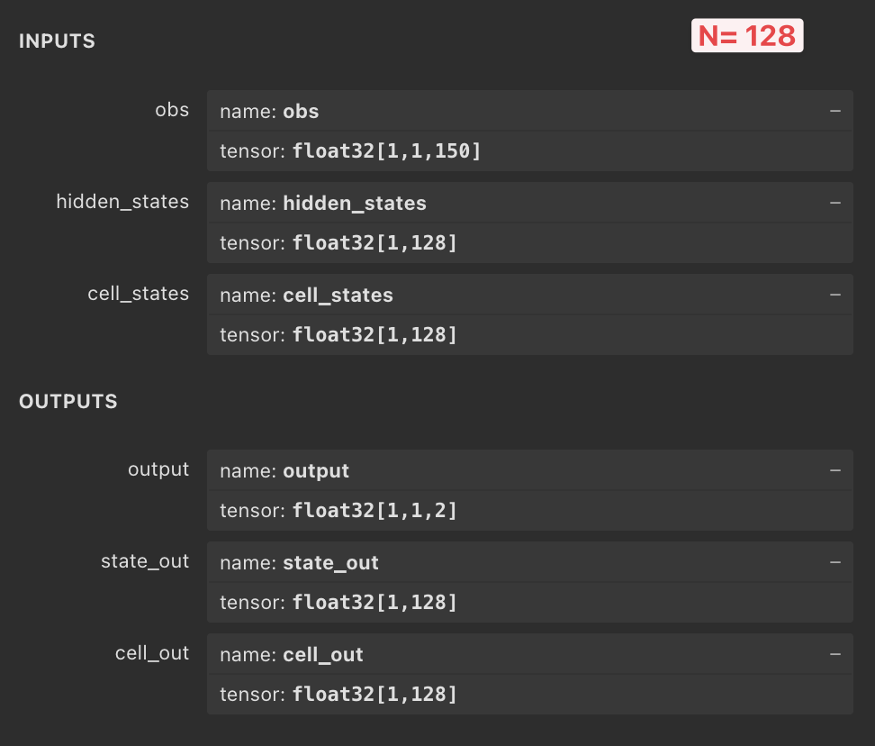

# Public repository for FARC (Fast Actor Conservative Critic)
Submission for the 2nd Bandwidth Estimation Challenge at ACM MMSys 2024

## 🥈 FARC Ranked 2nd in the final challenge

## Installation
Install the required Python packages

```bash
pip3 install -r requirements.txt
```

Download both `testbed` ([🔗Link](https://github.com/microsoft/RL4BandwidthEstimationChallenge/blob/main/download-testbed-dataset.sh)) and `emulated` ([🔗Link](https://github.com/microsoft/RL4BandwidthEstimationChallenge/blob/main/download-emulated-dataset.sh)) datasets from and put them into `Data`folder

Split them into `train` and `test`folders. We used `98%` of the data for training and `2%` for testing.

Final structure should look like this:
```
|-- Data
|   |-- emulated_dataset
|   |   |-- train
|   |   |-- test
|   |-- testbed_dataset
|   |   |-- train
|   |   |-- test
```

## Training
To train the model, first run the `train_critic.py` script to train the critic model. 

Once the training for the `critic` model is done, you can run the `train_actor.py` script to train the `actor` model.

## Evaluation
To evaluate the model, run the `evaluate.py` script. 

This will evaluate the model on the test subset of emulated dataset and save the results in the `figs` folder.

## ONNX Visualization
You can find the visualization of the ONNX model using the [Netron](https://netron.app/) tool below:



## Citation
If you use this code in your research, please cite our paper:

```
To be updated
```
